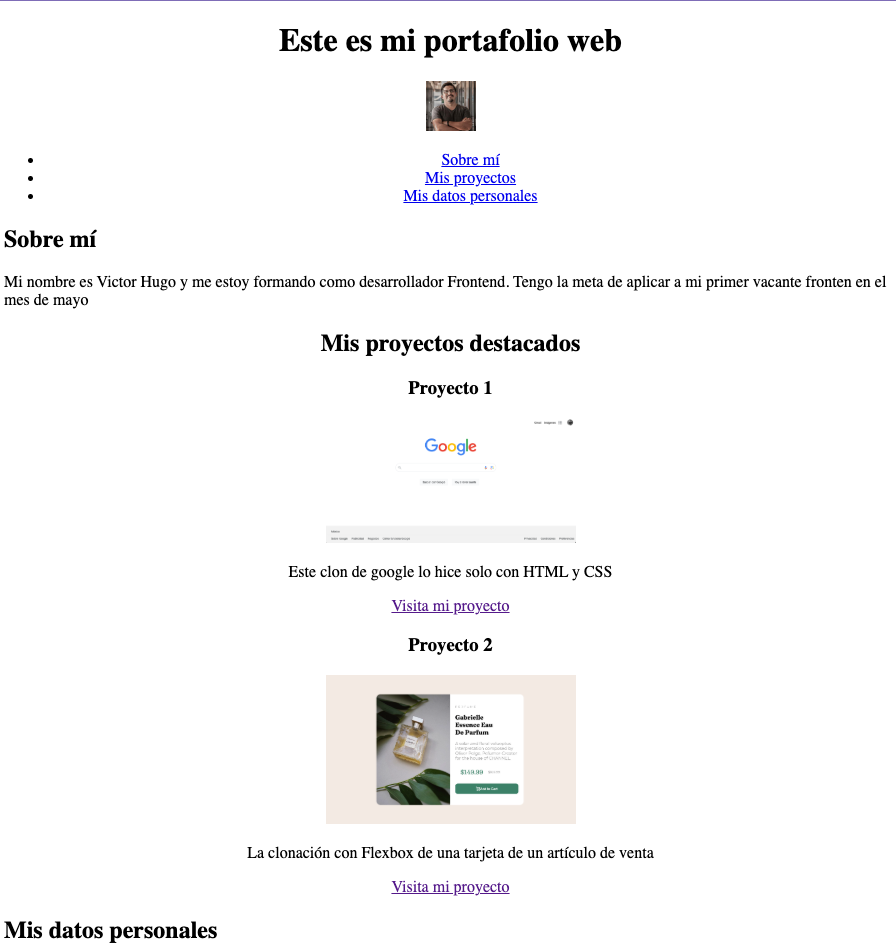

# Este proyecto es mi portafolio solo con HTML

En este módulo aprendimos a usar HTML, subir los proyectos a Github y un flujo sencillo de git desde la terminal.

Puedes vicitar mi sitio web en el siguiente <https://vviguerashd.github.io/Clase8/>

Mi proyecto actualmente se ve así: 